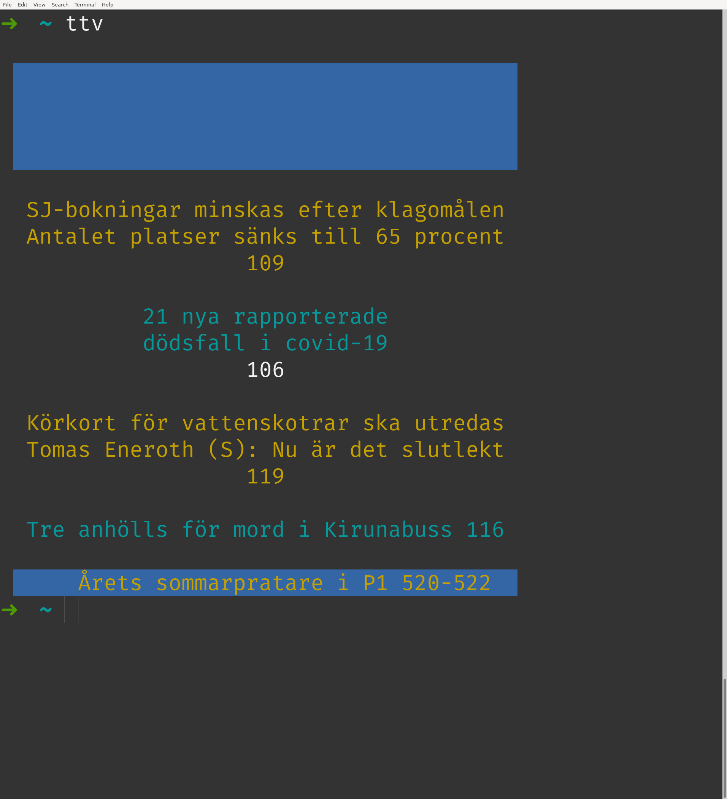
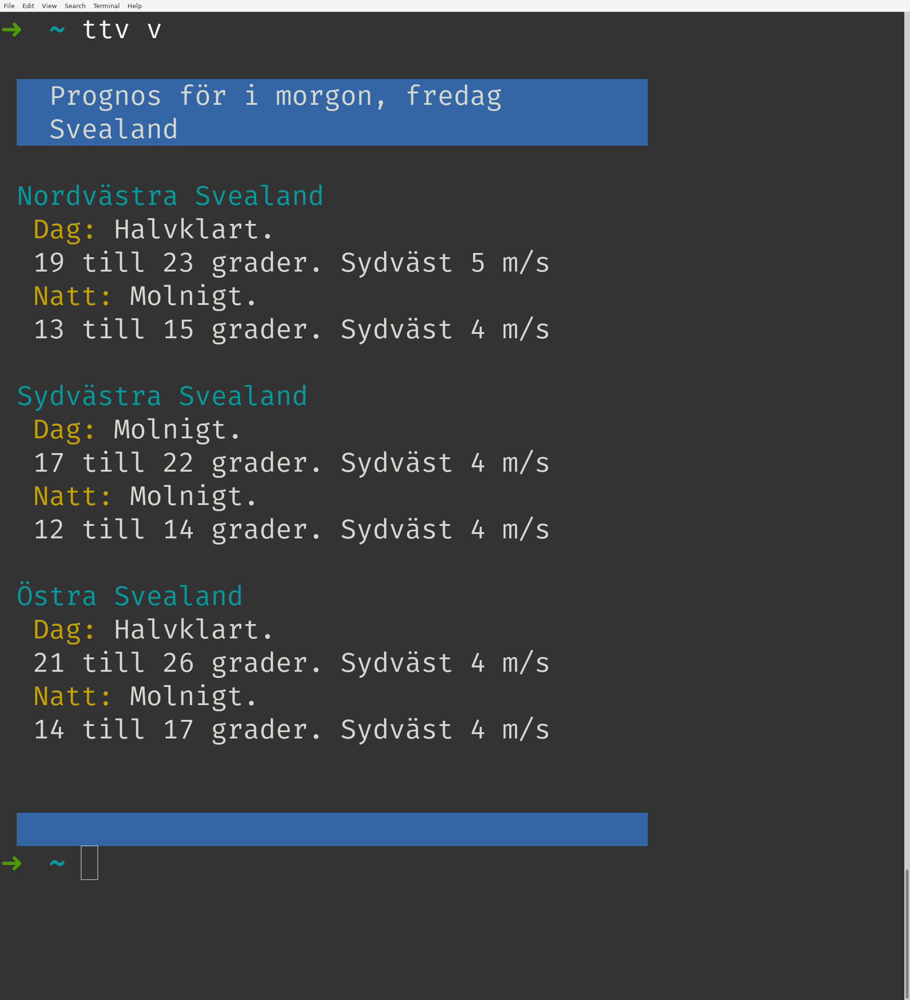

# ttv - SVT Text i terminalen
Script som hämtar, parsar och visar upp text-tv sidor i terminalen. Utskrifterna är ett mellanting mellan web- och TV-lägena, vilket innebär bibevarad färgkodning från TV-läget men avsaknad av förekommande bild-element,t.ex. Sverigekartan i väderleken.

### Exempel
```sh
$ ttv 377
```

```sh
$ ttv
```

```sh
$ ttv v
```


### Beroenden
- bash
- curl

### Version
0.1 - (2020-07-16) Snabbast (och förmodligen fulast) möjliga lösning, _bör gå att snygga till avsevärt_! Kan bugga ur vid vissa färgkombinationer jag ännu inte inkluderat. Vid ogiltig förfrågning, t.ex. icke-existerande sida, returneras i regel enbart fel från curl.

### Installation
1. Klona eller ladda ner repo eller enbart skriptet (ttv).
2. Se till att curl är installerat. T.ex.
    ```sh
    $ which curl
    /usr/bin/curl
    ```
    Vid tomt svar finns vanligtvis curl i standardrepona för vanliga distributioner och kan installeras, t.ex. i olika Debianförgreningar som Ubuntu, PopOS m.fl. enligt:
    ```sh
    sudo apt update && sudo apt install curl
    ```
3. Se till att ttv-skriptet är exekverbart, t.ex. genom att i installationskatalogen
    ```sh
    $ chmod u+x ttv
    ```
4. Kör med ```./ttv``` om du befinner dig i katalogen för ttv, eller använd fullständiga sökvägen.
5. (Valfritt) Lägg till ett alias i
    ```sh
    ~/.bash_aliases
    ```
    om bash används som skal, eller i
    ```sh
    ~/.zshrc
    ```
    om zsh används.
    Ligger ttv exempelvis i ```~/git/ttv/``` blir det
    ```sh
    alias ttv=/home/ANVNAMN/git/ttv/ttv
    ```
    där ```ANVNAMN``` ersätts med aktuellt användarnamn (svaret på ```$ whoami``` vid osäkerhet av någon anledning).
4. (Valfritt) Genvägar kan justeras direkt i skriptet genom att öppna ttv med favorit-textredigerare. Som standard är t.ex. 'v' dagens väderlek för Svealand:
    ```sh
    elif [ "$1" = "v" ]
      then
        PAGE="406"
    ```
